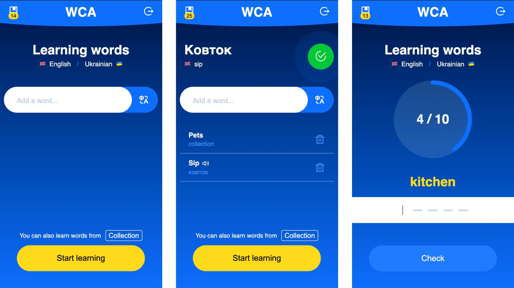
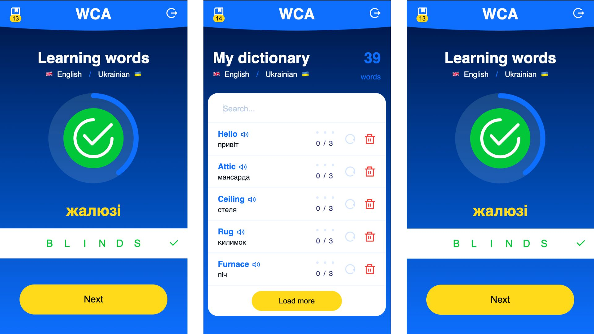
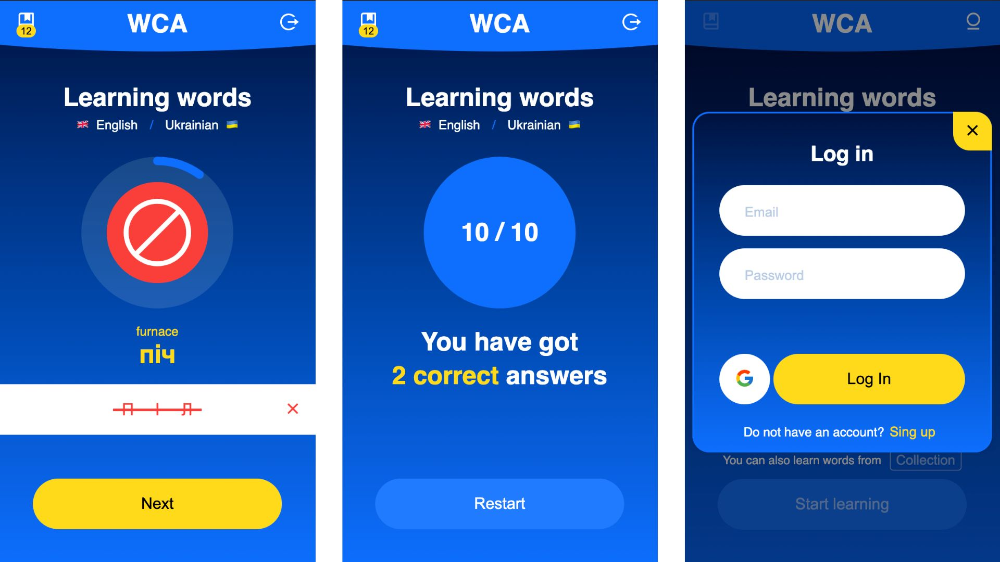

### A simple web application to learn English/Ukrainian words

---

- simple auth and adding words (word sets are available)
- interactive learning process
- following the progress

To start using the app, just follow the link: **[words-coach-app.fun](https://words-coach-app.fun/)**

### Screenshots

---

### Reporting Issues

---

If you're experiencing a problem that you feel is a bug or have ideas for improving my app, I encourage you to open an issue and share your feedback.

### Get Involved

---

I welcome your feedback and ideas. Here's how to reach me with feedback and questions:

- [Facebook](https://www.facebook.com/A.Krivulko)
- [Telegram](https://t.me/newdisease)
- [Email](mailto:newdisease91@gmail.com)
- [LinkedIn](https://www.linkedin.com/in/andrii-kryvulko/)
